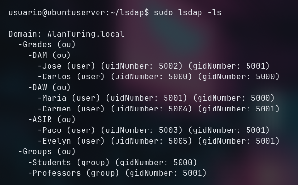
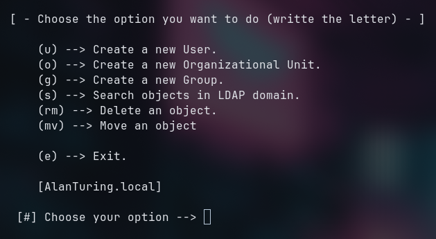

# lsdap

lsdap is a set of programs used to manage, install and configure an LDAP domain, it also can add clients to a Domain. 
You can list, add, move and remove objects from the Domain.
You will also be able to connect to your client devices via AnyDesk and SSH, saving their passwords. This feature must be enabled if you want to use it.



## Installation and Updates
To run this script, simply clone the repository, make the file executable, and run it. Follow the on-screen prompts to successfully install LDAP."

```bash
cd
git clone https://github.com/cl0b3r/lsdap.git
cd lsdap
chmod +x set-up.sh
sudo ./set-up.sh 
```

To update LDAP, simply go to your repository directory and run the following command:
```bash
sudo ./update.sh
```


## Usage
Use sudo always you can run the script, NEVER run it directaly as root, ALWAYS use sudo.
The syntax is very simple, you can always see it running "lsdap -h".
Here is how to use it:

```bash
Usage: lsdap [option] [arguments]
     Options:
      -ls  [object]         List objects in LDAP domain. Object is optional.
      -new [object] [name]  Create a new object in LDAP domain. 
      -mv  [object] [name]  Move an object to another location in LDAP domain.
      -rm  [object] [name]  Delete an object from LDAP domain. 
      -ssh [user@host]      Configure SSH access for a user in LDAP domain.
      -ad  [host]           Configure AnyDesk access for a user in LDAP domain.
      -menu                 Use lsdap using an interactive menu.
      -uninstall            Uninstall the LDAP domain and all its data.
      -h                    Display this help message.

Object can be 'ou', 'user' or 'group'.
Name, username and host are always required.
```

## Usage via Menu
Run ```lsdap -menu``` to use all the features with an interactive Menu.



## Global directory and configuration
The main folder for lsdap is /usr/local/share/lsdap, you can change your configuration editing data.conf.
 In that folder you will find:
      - bins (Folder who contains all the binaries who use lsdap)
      - data.conf (main configuration file)
      - file.ldif (This is the file where goes LDAP objects schemas)
      - AnyDeskSSH  (Folder with scripts, and logs for SSH and AnyDesk connections) 


## SSH and AnyDesk
LSDAP also enables connections to your clients via SSH or AnyDesk, all SSH and AnyDesk configurations and scripts are stored in the AnyDeskSSH directory inside the main installation path.
You can connect using either command-line arguments or the interactive menu."
The following sections explain how these features work.

To setup SSH and AnyDesk you should run ```setup.sh``` inside AnyDeskSSH folder with sudo.

### Get Credentials of the users


### SSH

### AnyDesk

